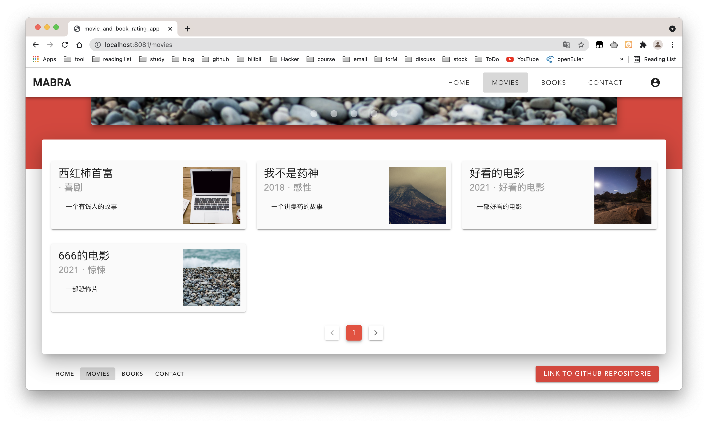
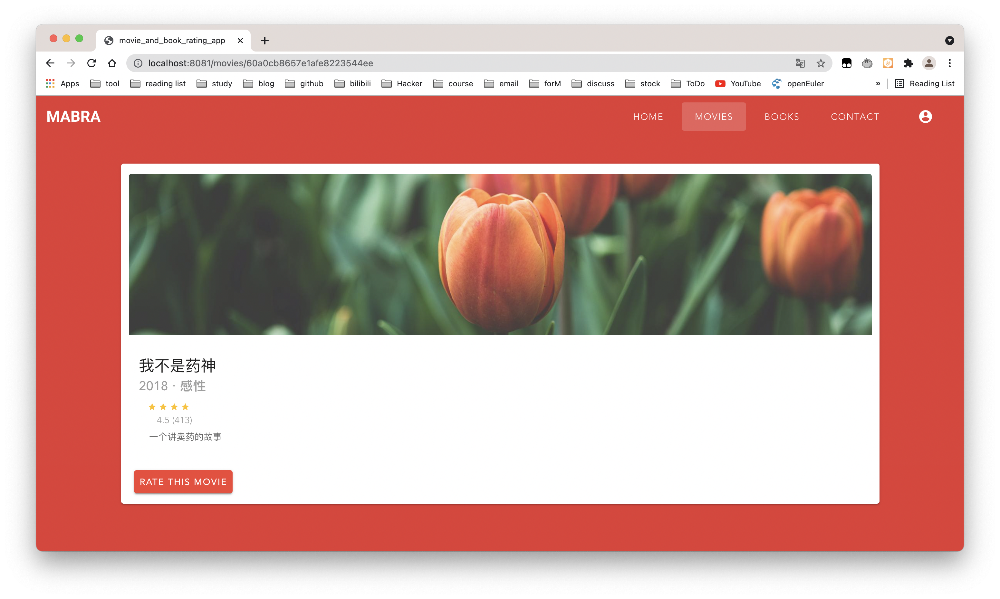
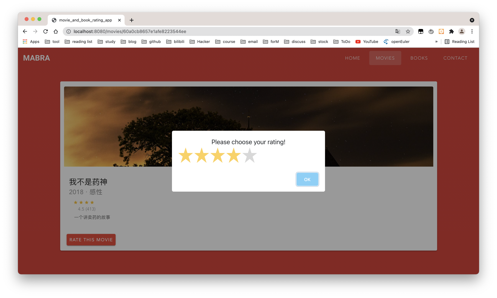
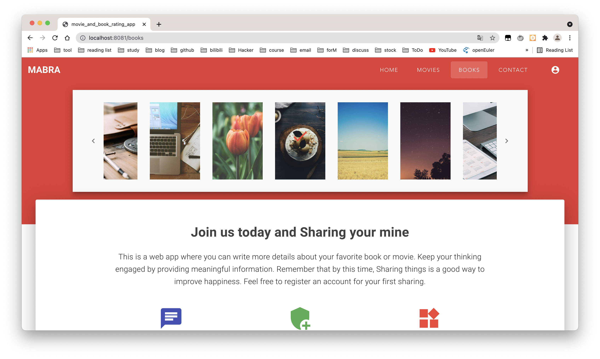

# 项目介绍

- 这是一个基于 vue 的电影与书籍评分推荐 webapp ，目前完成的功能不多。主要是按照作业需求做了一些页面，页面中使用到的组件主要有导航栏、导航、轮播器、列表组、媒体对象、卡片、表单、分页、按钮组、输入组、弹出框等。

- 本项目目前支持的功能有注册登录，添加电影详情，电影评分等

- 计划完成内容

  - 页面展示内容完善

    - 主页需介绍项目主要功能

  - 电影页轮播图从单纯的图片展示更换至点击后进入电影详情，轮播图图片由本地服务器随机选取数据库内容。
    - 电影详情页图片
  - 书籍页图片由本地服务器随机选取数据库内容，点击书籍后，图片下方内容刷新至该书籍的详情。
    - 联系我们添加上个人的一些介绍还有联系方式
  - 注册登录页参考 [codepen](https://codepen.io/FlorinPop17/pen/vPKWjd) 完成
  - 功能完善
    - 注册登录添加
      - Google(OAuth) authentication strategies
      - Wechat authentication strategies
    - 电影页分页，电影评分功能完善
    - 添加电影详情页还需要添加改、删操作
    - 书籍页同电影页，增删改查操作
    - 国际化多语言配置
  - 项目测试
  - 项目部署

# 技术栈

vue2 + vue-router + vuetify + axios + express + MongoDB + Node

# 数据库设计

1. 已完成部分

- 用户 User

|   字段   |  类型  |            说明            |
| :------: | :----: | :------------------------: |
|   \_id   | String | mongoDB 自带的文档唯一索引 |
|   name   | String |           用户名           |
|  email   | String |            邮箱            |
| password | String |            密码            |

- 添加电影 Movie

|     字段     |  类型  |            说明            |
| :----------: | :----: | :------------------------: |
|     \_id     | String | mongoDB 自带的文档唯一索引 |
|     name     | String |          电影名称          |
| description  | String |          电影简介          |
| release_year | Number |          上映日期          |
|    genre     | String |          电影类型          |

- 电影评分 Rating

|   字段   |  类型  |   说明   |
| :------: | :----: | :------: |
| movie_id | String | 电影 id  |
| user_id  | String | 用户 id  |
|   rate   | Number | 用户评分 |

2. 未完成部分

- 添加书籍 Book

|     字段     |  类型  |            说明            |
| :----------: | :----: | :------------------------: |
|     \_id     | String | mongoDB 自带的文档唯一索引 |
|     name     | String |          书籍名称          |
| description  | String |          书籍简介          |
| release_year | Number |          出版日期          |
|    genre     | String |          书籍类型          |

- 书籍评分 BookRating

|  字段   |  类型  |   说明   |
| :-----: | :----: | :------: |
| book_id | String | 书籍 id  |
| user_id | String | 用户 id  |
|  rate   | Number | 用户评分 |

# 目录结构

```
.
|-- models
|   |-- User.js
|   |-- Rating.js
|   `-- Movie.js
|-- controllers
|   |-- users.js
|   `-- movies.js
|-- src
|   |-- router
|   |   `-- index.js
|   |-- plugins
|   |   `-- vuetify.js
|   |-- main.js
|   |-- components
|   |   |-- Register.vue
|   |   |-- Movies.vue
|   |   |-- Movie.vue
|   |   |-- Login.vue
|   |   |-- Home.vue
|   |   |-- Contact.vue
|   |   |-- Books.vue
|   |   `-- AddMovie.vue
|   |-- bus.js
|   |-- assets
|   |   `-- stylesheets
|   |       |-- main.css
|   |       `-- home.css
|   `-- App.vue
|-- server.js
|-- index.html
|-- config
|-- build
|-- test
|-- static
|-- package.json
|-- package-lock.json
`-- README.md
```

# 项目运行

- 克隆整个项目到本地并切换到项目所在文件夹
- npm install
- npm run dev
- npx nodemon server.js

# 项目部分截图

1. 首页


2. 电影页




3. 电影详情页



4. 电影评分



5. 书籍页



6. 添加电影


7. 注册登录


